# Traffic Light Control:

## 1. Design Specifications:
Design a traffic light controller using FSM and following specification:
- Clock frequency: 10MHz
- Control red (18s), yellow (3s), green light (15s)
- Control 7 segments led light

  To simplify project, only control 1 direction of the road.

   
|      Port     |      Bus size| Direction  |    Description   |
| :------------:|:-------------:|:--------:|:-----------:      |
|    clk        |        1     |  input    |    10MHz clock    |
|     rst_n     |        1     |  input    | Active low asynchronous reset|
|     en        | 1            |  input    | Active enable     |
|    red_light  |        1     |  output   | enable red light  |
|  yellow_light |        1      |   output | enable yellow light |
|green_light    | 1             |   output | enable green light    |
|display_led    | 16             |   output | 7 segment display, 2 digits |

The 7 segments led display code can be found in the image below:

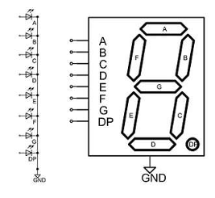  

The bit mapping of signal display_led to the segments is: {A,B,C,D,E,F,G,DP}
(this mean MSB is segment A and LSB is DP)

>[!NOTE]
>Before reading further, readers are encouraged to think about solution first.

From the problem, we will need following blocks:

• FSM to control state of the design. We need at least 3 states RED, YELLOW, GREEN. We also need IDLE state when the system is not enabled.

• Because clock frequency is 10MHz, we need 1 counter to count the clock cycles and notify when 1 second is reached.

• We also need another counter to count the number of seconds has passed to switch lights.

• A 7 segment decoder to convert the value on the counter to leds.

An overall block diagram can be found below:

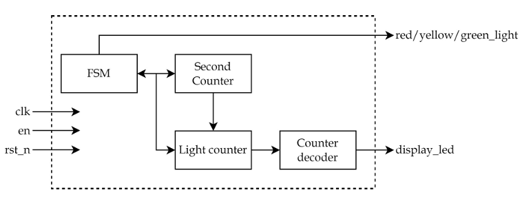  

## 2. Detail designing the blocks:

From figure, we can go further to design the block's functions and interfaces.

### 2.1 Second block counter:

From the clk signal's frequency, we understand 1 second is equal to 100 cycles of this clock, thus this clock counter needs to count from 99 to 0 then reset automatically.

At every last value, it sends out signal last to indicates one second has passed. It also send out pre_last that is 1 cycle sooner than last, this signal help the FSM to catch up with the last cycle (because the FSM has register on the output)

The interface diagrams and waveform can be found in below figures:

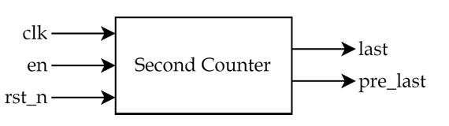  

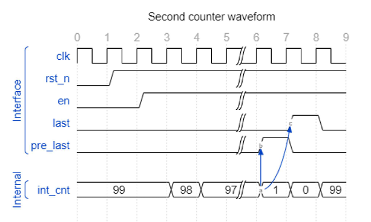  

#### Source code Second block counter:

```SystemVerilog
module Second_counter #(parameter pMAX_VAL=99)
(
	input logic clk,  
  	input logic en,
  	input logic rst_n,
  	output logic last,
  	output logic pre_last,
  	output logic [$clog2(pMAX_VAL+1)-1:0] count // degbug variable
);
  
  `ifndef SYNTHESIS
  	timeunit 1ps;
    timeprecision 1ps;
  `endif
  
  localparam pCNT_WIDTH = $clog2(pMAX_VAL+1);
  logic [pCNT_WIDTH-1:0] int_count;
  
  always_ff@(posedge clk or negedge rst_n)	begin: cnt_proc
    if(!rst_n)	begin
      int_count<=pMAX_VAL;
    end
    else if(en)	begin
      if(|int_count)	begin
        int_count<=int_count-1;
      end
      else	begin
        int_count<=pMAX_VAL;
      end
    end
    else	begin
      int_count<=pMAX_VAL;
    end
  end: cnt_proc
  assign last=(int_count==0)? 1'b1:1'b0;
  assign pre_last=(int_count==1)? 1'b1:1'b0;
//   assign last=~(|int_count);
//   assign pre_last=(int_count==1)? 1'b1:1'b0;
endmodule: Second_counter
```
>[!NOTE]
> The directive SYNTHESIS make sure the code does not exist in synthesize step because the keywords timeunit and timeprecision are only meaningful in simulation step.

### 2.2 Light counter:

This light control need to be initialized with different value (red, green, blue), so it has init port with bus size is 3, each bit is for 1 light. This counter only counts down in each second (not each clock), it is enabled by last value of the second counter.

The interface diagrams and waveform can be found in below figures

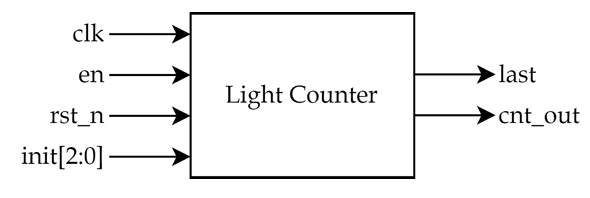  

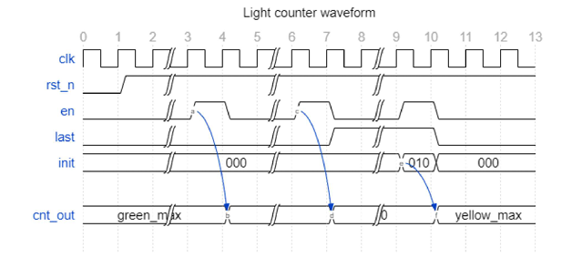  

#### Source code light counter:

```SystemVerilog
// Code your design here
module Light_Counter #(
  parameter pGREEN_INIT_VAL = 14,
  parameter pYELLOW_INIT_VAL = 2,
  parameter pRED_INIT_VAL = 17,
  parameter pCNT_WIDTH = $clog2(pRED_INIT_VAL+1),
  parameter pINIT_WIDTH = 3
)
  (
    input logic clk,
    input logic en,
    input logic rst_n,
    input logic [pINIT_WIDTH-1:0] init,
    output logic last,
    output logic [pCNT_WIDTH-1:0] cnt_out
  );
  `ifndef SYNTHESIS
    timeunit 1ps;
    timeprecision 1ps;
  `endif
  
  localparam pGREEN_IDX=0;
  localparam pYELLOW_IDX=1;
  localparam pRED_IDX=2;
  reg [pINIT_WIDTH-1:0] init_tmp;
//   enum integer {pGREEN_IDX=0,pYELLOW_IDX=1,pRED_IDX=2} index;
//   index idx;
  always_ff@(posedge clk or negedge rst_n )	begin:	cnt_proc
    if(!rst_n)	begin
      cnt_out<=pGREEN_INIT_VAL;
//       init_tmp<=3'b000;
    end
    else if(init[pGREEN_IDX])	begin
      cnt_out<=pGREEN_INIT_VAL;
//       init_tmp<=init[pGREEN_IDX];
    end
    else if(init[pYELLOW_IDX])	begin
      cnt_out<= pYELLOW_INIT_VAL;
//       init_tmp<=init[pYELLOW_IDX];
    end
    else if(init[pRED_IDX])	begin
      cnt_out<=pRED_INIT_VAL;
//       init_tmp<=init[pRED_IDX];
    end 
    else if(en)	begin
//       if(cnt_out!=0)	begin
      	cnt_out<=cnt_out-1;
//       end
    end
  end:	cnt_proc
    assign last=(cnt_out==0)? 1'b1:1'b0;
endmodule: Light_Counter
```
In this design, init has higher priority than enable so it won't count down if init is not zero.

### 2.3 FSM block:

This block connects with the 2 mentioned counters and control the red/yello/green lights. The indexes of the light control signals must match with the indexes of the light counter block.

The interface and state of this block is shown in below figures.

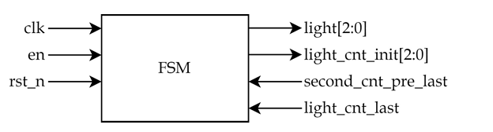  

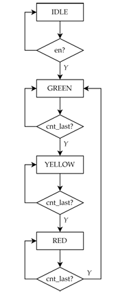  

cnt_last signal in diagram above is a function of second_cnt_pre_last and light_cnt_last

>[!NOTE]
> Eventhough not shown, the state will return to IDLE if the signal is zero.

### Source code FSM block:

```SystemVerilog
// Code your design here
module Light_FSM #(parameter LIGHT_STATE_WIDTH=3)(
  input logic clk,
  input logic en,
  input logic rst_n,
  input logic light_cnt_last,
  input logic second_cnt_pre_last,
  output logic [LIGHT_STATE_WIDTH-1:0] light,
  output logic [LIGHT_STATE_WIDTH-1:0] light_cnt_init
);
  `ifndef SYNTHESIS
    timeunit 1ps;
    timeprecision 1ps;
  `endif
  localparam pGREEN_IDX=0;
  localparam pYELLOW_IDX=1;
  localparam pRED_IDX=2;
  localparam STATE_WIDTH=2;
  typedef enum logic[STATE_WIDTH-1:0]{
    IDLE,
    GREEN,
    YELLOW,
    RED
  }STATE;
  STATE light_current_state, light_next_state;
  typedef struct packed{
    logic [LIGHT_STATE_WIDTH-1:0] light;
    logic [LIGHT_STATE_WIDTH-1:0] light_cnt_init;
  }SIGNAL_OUT;
  SIGNAL_OUT signal_current_state, signal_next_state;
  logic last_cnt;
  assign last_cnt=light_cnt_last&second_cnt_pre_last;
  assign light=signal_current_state.light;
  assign light_cnt_init=signal_current_state.light_cnt_init;
  always_ff@(posedge clk or negedge rst_n)	begin: fsm_ff_proc
    if(!rst_n)	begin
      light_current_state<=IDLE;
      signal_current_state<='{default:0};
    end
    else if(en)	begin
        light_current_state<=light_next_state;
        signal_current_state<=signal_next_state;
    end
    else begin
      light_current_state<=IDLE;
      signal_current_state<='{default:0};
    end
  end: fsm_ff_proc
  
  always_comb	begin: fsm_comb_proc
      light_next_state=IDLE;
      signal_next_state='{default:0};
    case(light_current_state)	
      IDLE:	begin 
        if(en)	begin
          light_next_state=GREEN;
          signal_next_state.light[pGREEN_IDX]=1'b1;
//           signal_next_state.light_cnt_init[pGREEN_IDX]=1'b1;
      end
        else	begin
          light_next_state=IDLE;
      	  signal_next_state='{default:0};
        end
//         light_next_state=GREEN;
//         signal_next_state.light[pGREEN_IDX]=1'b1;
      end
      GREEN: begin
        if(last_cnt)	begin
          light_next_state=YELLOW;
          signal_next_state.light[pYELLOW_IDX]=1'b1;
          signal_next_state.light_cnt_init[pYELLOW_IDX]=1'b1;
      end
        else	begin
          light_next_state=GREEN;
          signal_next_state.light[pGREEN_IDX]<=1'b1;
//           signal_next_state.light_cnt_init[pGREEN_IDX]=1'b1;
        end
      end
      YELLOW:	begin 
        if(last_cnt)	begin
          light_next_state=RED;
          signal_next_state.light[pRED_IDX]=1'b1;
          signal_next_state.light_cnt_init[pRED_IDX]=1'b1;
      end
        else	begin
          light_next_state=YELLOW;
          signal_next_state.light[pYELLOW_IDX]=1'b1;
//           signal_next_state.light_cnt_init[pYELLOW_IDX]=1'b1;
        end
      end
      RED:	begin 
        if(last_cnt)	begin
          light_next_state=GREEN;
          signal_next_state.light[pGREEN_IDX]=1'b1;
          signal_next_state.light_cnt_init[pGREEN_IDX]=1'b1;
      end
        else	begin
          light_next_state=RED;
          signal_next_state.light[pRED_IDX]=1'b1;
//           signal_next_state.light_cnt_init[pRED_IDX]=1'b1;
        end
      end
    endcase
  end: fsm_comb_proc
endmodule: Light_FSM
```

### 2.4 Counter decoder:

The counter decoder doesn't have any register. It only convert value from light counter block to 7- segments LEDs.

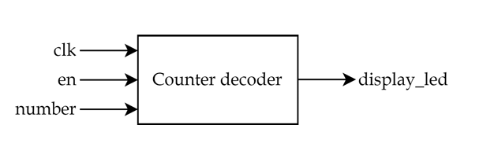  

#### Source code Counter decoder:

```SystemVerilog
// Code your design here
module Counter_decoder #(
  parameter pNUMBER_WIDTH=5,
  parameter pLED_WIDTH=8,
  parameter pLED_NO=2
)
  (

	input logic clk,
  	input logic en,
  	input logic [pNUMBER_WIDTH-1:0] number,
    output logic [pLED_NO-1:0][ pLED_WIDTH-1:0] display_led
);
  
  logic [7:0] dozens;
  logic [7:0] unit;
  
  always_comb	begin: decoder_proc
    if(en) begin
      case(number)
        5'd0:	begin
          dozens=8'h0x3F;
          unit=8'h0x3F;
        end
        5'd1:	begin
          dozens=8'h0x3F;
          unit=8'h0x06;
        end
        5'd2:	begin
          dozens=8'h0x3F;
          unit=8'h0x5B;
        end
        5'd3:	begin
          dozens=8'h0x3F;
          unit=8'h0x40;
        end
        5'd4:	begin
          dozens=8'h0x3F;
          unit=8'h0x66;
        end
        5'd5:	begin
          dozens=8'h0x3F;
          unit=8'h0x6D;
        end
        5'd6:	begin
          dozens=8'h0x3F;
          unit=8'h0x7D;
        end
         5'd7:	begin
          dozens=8'h0x3F;
          unit=8'h0x07;
        end
         5'd8:	begin
          dozens=8'h0x3F;
          unit=8'h0x7F;
        end
         5'd9:	begin
          dozens=8'h0x3F;
          unit=8'h0x6F;
        end
        
        
        5'd10:	begin
          dozens=8'h0x06;
          unit=8'h0x3F;
        end
        5'd11:	begin
          dozens=8'h0x06;
          unit=8'h0x06;
        end
        5'd12:	begin
          dozens=8'h0x06;
          unit=8'h0x5B;
        end
        5'd13:	begin
          dozens=8'h0x06;
          unit=8'h0x40;
        end
        5'd14:	begin
          dozens=8'h0x06;
          unit=8'h0x66;
        end
        5'd15:	begin
          dozens=8'h0x06;
          unit=8'h0x6D;
        end
        5'd16:	begin
          dozens=8'h0x06;
          unit=8'h0x7D;
        end
         5'd17:	begin
          dozens=8'h0x06;
          unit=8'h0x07;
        end
         5'd18:	begin
          dozens=8'h0x06;
          unit=8'h0x7F;
        end
         5'd19:	begin
          dozens=8'h0x06;
          unit=8'h0x6F;
        end
     endcase
  end
  end: decoder_proc
  assign display_led[1]=dozens;
  assign display_led[0]=unit;
endmodule: Counter_decoder
```

### 2.5 Connect together:

#### Source code Connect all:

```SystemVerilog
// Code your design here
`include"Light_FSM.sv"
`include"Light_control_counter.sv"
`include"Second_counter.sv"
`include"Counter_decoder.sv"
`ifndef SYNTHESIS
    timeunit 1ps;
    timeprecision 1ps;
  `endif
module Traffic_light #(
	parameter pSECOND_CNT_VALUE=99,
  	parameter pGREEN_INIT_VAL = 14,
    parameter pYELLOW_INIT_VAL = 2,
    parameter pRED_INIT_VAL = 17
//     parameter pCNT_WIDTH = $clog2(pRED_INIT_VAL+1),
//     parameter pINIT_WIDTH = 3 
)(
	input logic clk,
  	input logic en,
  	input logic rst_n,
  	output logic green_light,
  	output logic yellow_light,
  	output logic red_light,
	output logic [$clog2(pSECOND_CNT_VALUE+1)] count 
);
  localparam pNUMBER_WIDTH=5;
  localparam pLED_WIDTH=8;
  localparam pLED_NO=2;
  
  localparam pGREEN_IDX=0;
  localparam pYELLOW_IDX=1;
  localparam pRED_IDX=2;
  localparam pLIGHT_CNT_WIDTH = $clog2(pRED_INIT_VAL+1);
  localparam pINIT_WIDTH = 3;
  localparam pSECOND_CNT_WIDTH=$clog2(pSECOND_CNT_VALUE+1);
  localparam LIGHT_STATE_WIDTH=3;
//   localparam LIGHT_COLOR=2;
//   localparam pINIT_WIDTH = 3;
  logic second_cnt_last,second_cnt_pre_last;
  
  logic [pINIT_WIDTH-1:0] light_cnt_init;
  logic light_cnt_last;
  logic [pLIGHT_CNT_WIDTH-1:0] light_cnt_out;
  logic light_cnt_en;
  logic [LIGHT_STATE_WIDTH-1:0] light;
  
  logic[ pLED_WIDTH-1:0] display_led_dozens;
  logic[ pLED_WIDTH-1:0] display_led_unit;
//   logic [$clog2(pSECOND_CNT_VALUE+1)] count;
  Second_counter #(pSECOND_CNT_VALUE) second_cnt(
    .clk(clk),
    .en(en),
    .rst_n(rst_n),
    .last(second_cnt_last),
    .pre_last(second_cnt_pre_last),
    .count(count)
  );
  
  assign light_cnt_en=en&second_cnt_last;
  Light_Counter #(
    .pGREEN_INIT_VAL(pGREEN_INIT_VAL),
    .pYELLOW_INIT_VAL(pYELLOW_INIT_VAL),
    .pRED_INIT_VAL(pRED_INIT_VAL),
    .pCNT_WIDTH(pLIGHT_CNT_WIDTH),
    .pINIT_WIDTH(pINIT_WIDTH)
  ) dut1 (
    .clk(clk),
    .en(light_cnt_en),
    .rst_n(rst_n),
    .init(light_cnt_init),
    .last(light_cnt_last),
    .cnt_out(light_cnt_out)
  );
  
  Counter_decoder #(
        .pNUMBER_WIDTH(pNUMBER_WIDTH),
        .pLED_WIDTH(pLED_WIDTH),
        .pLED_NO(pLED_NO)
  ) dut2 (
        .clk(clk),
        .en(en),
        .number(light_cnt_out),
    	.display_led({display_led_dozens,display_led_unit})
    );
  
  Light_FSM #(.LIGHT_STATE_WIDTH(LIGHT_STATE_WIDTH)) dut3 (
    .clk(clk),
    .en(en),
    .rst_n(rst_n),
    .light_cnt_last(light_cnt_last),
    .second_cnt_pre_last(second_cnt_pre_last),
    .light(light),
    .light_cnt_init(light_cnt_init)
  );
  assign green_light= light[pGREEN_IDX];
  assign yellow_light= light[pYELLOW_IDX];
  assign red_light= light[pRED_IDX];
endmodule: Traffic_light
```

## Simulation:

### EPWAVE:

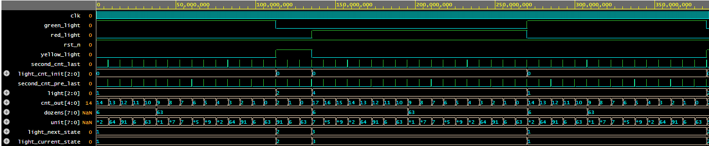  

### Log file:

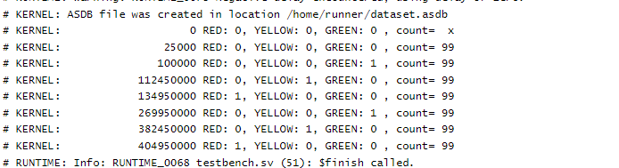  


